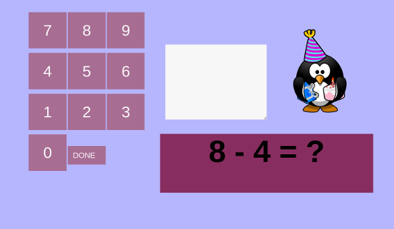

# natan-js - Maths Game for Kids


A web based app I made for my nephew. Intended to teach young kids basic arithmetic (addition and subtraction) with positive numbers.
  
## Features
* Addition :heavy_plus_sign:
* Subtraction :heavy_minus_sign:
* No negative numbers
* Input using touchscreen/mouse :computer_mouse:
* Tablet support (especially ipad) using custom CSS
* HTML 5
* 100 % vanilla Javascript

Since children don't know the validity of basic mathematical proofs that adults take for granted. For example:

```
a + b == b + a

```

It also randomizes the output of the ordering. However, it does not generate problems where the answer is less than 0. This is because the concept of negative-numbers is too abstract for young kids.

## Usage
* Click Start-button to Start the game
* The game generates 10 random maths problems one-by-one.
* It randomizes the numbers with a a number range of 1-11 for the **first number** and 1-30 for the **second number**
* Writes victory message when correct answer is given.

## :penguin: Attribution
The image of birthday Tux is courtesy of [Pixabay](https://pixabay.com/images/id-161107/)

## Licence
Made in 2019. MIT Licence
